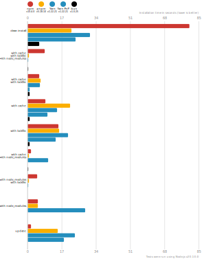

# Benchmarks of JavaScript Package Managers

This benchmark compares the performance of [npm](https://github.com/npm/cli), [pnpm](https://github.com/pnpm/pnpm), [Yarn](https://github.com/yarnpkg/yarn) and [Bun](https://bun.sh/).

Here's a quick explanation of how these tests could apply to the real world:

- `clean install`: How long it takes to run a totally fresh install: no lockfile present, no packages in the cache, no `node_modules` folder.
- `with cache`, `with lockfile`, `with node_modules`: After the first install is done, the install command is run again.
- `with cache`, `with lockfile`: When a repo is fetched by a developer and installation is first run.
- `with cache`: Same as the one above, but the package manager doesn't have a lockfile to work from.
- `with lockfile`: When an installation runs on a CI server.
- `with cache`, `with node_modules`: The lockfile is deleted and the install command is run again.
- `with node_modules`, `with lockfile`: The package cache is deleted and the install command is run again.
- `with node_modules`: The package cache and the lockfile is deleted and the install command is run again.
- `update`: Updating your dependencies by changing the version in the `package.json` and running the install command again.

## Angular App

The app's `package.json` [here](./fixtures/angular-quickstart/package.json)

| action  | cache | lockfile | node_modules| npm | pnpm | Yarn | Yarn PnP | Bun |
| ---     | ---   | ---      | ---         | --- | --- | --- | --- | --- |
| install |       |          |             | 1m 20.4s | 21.6s | 30.9s | 23.7s | 5.9s |
| install | ✔     | ✔        | ✔           | 8.5s | 591ms | 272ms | n/a | 314ms |
| install | ✔     | ✔        |             | 5.8s | 6.3s | 6.1s | 942ms | 1s |
| install | ✔     |          |             | 8.7s | 21s | 14.7s | 9.9s | 1.1s |
| install |       | ✔        |             | 15.2s | 15.6s | 20.1s | 14.1s | 1.1s |
| install | ✔     |          | ✔           | 1.8s | 846ms | 10.2s | n/a | 320ms |
| install |       | ✔        | ✔           | 4.7s | 748ms | 329ms | n/a | 113ms |
| install |       |          | ✔           | 5s | 5s | 28.6s | n/a | 91ms |
| update  | n/a   | n/a      | n/a         | 1.7s | 14.9s | 23.5s | 17.9s | 108ms |

